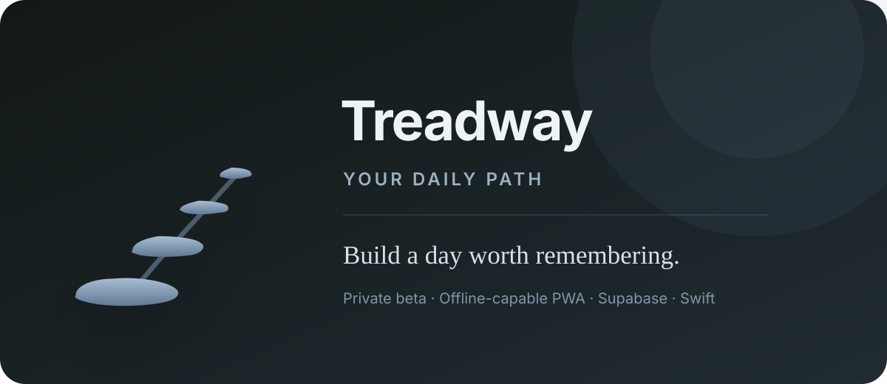
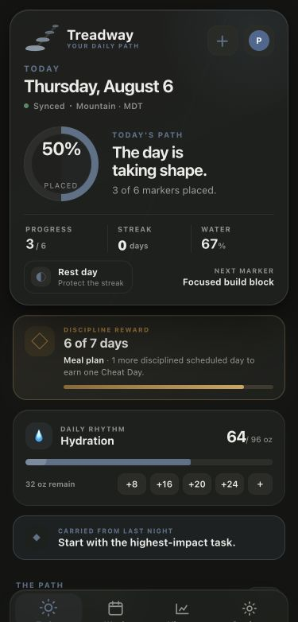
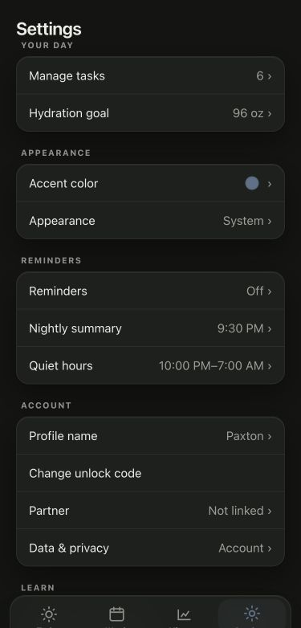

# Treadway



[](https://github.com/PB-Builds-creator/Treadway/actions/workflows/verify.yml)
[](https://cairn.surge.sh)
[](LICENSE)

Treadway is a private, installable daily-discipline app that turns routines into a calm daily path. It combines task completion, hydration, streak protection, end-of-day reflection, weekly review, and deliberately limited partner accountability in one offline-capable PWA.

**Status:** working private beta, actively developed and used on real devices. The public deployment is access-gated; the repository documents the product and its engineering honestly while broader onboarding, automated browser coverage, and commercial infrastructure remain on the roadmap.

[Open the live app](https://cairn.surge.sh) · [Read the case study](Documentation/PORTFOLIO_CASE_STUDY.md) · [Explore the architecture](Documentation/WEB_ARCHITECTURE.md) · [View current status](Documentation/DEVELOPMENT_STATUS.md)

<p align="center">
  
  &nbsp;&nbsp;
  
</p>

## What it does

- Builds recurring daily and weekly routines with custom ordering, priorities, reminders, measurements, and deep links.
- Tracks hydration, streaks, rest days, saved days, history, and rolling weekly progress in Mountain Time with DST-safe date handling.
- Adds a short **Treadway Close** ritual: one win, one honest line, and tomorrow's first stone.
- Supports an earned **Cheat Day** state for meal-plan consistency without falsely counting the reward as another disciplined day.
- Syncs across devices through Supabase while preserving a local cache and queued offline writes.
- Keeps partner accountability intentionally narrow: a fixed “proud of you” signal and aggregate daily status, never tasks or journal text.
- Installs to the iPhone Home Screen as a full-screen PWA and supports web-push reminders.
- Provides data export, password recovery/change, account deletion, quiet hours, themes, reduced motion, and keyboard/screen-reader support.

## Why it is technically interesting

Treadway is intentionally framework-free on the client. A compact vanilla JavaScript state model renders the application, while carefully scoped CSS and Web Animations API effects keep the interface responsive on a phone. The architecture emphasizes:

- deterministic `America/Denver` calendar logic rather than fragile 24-hour arithmetic;
- owner-scoped Postgres Row Level Security as the server-side privacy boundary;
- optimistic local mutations with a durable offline outbox and server reconciliation;
- transform/opacity-only motion, frame-batched gestures, and reduced-motion fallbacks;
- explicit separation between private reflections and partner-visible aggregate signals;
- stable compatibility identifiers across product renames so existing sessions and installed PWAs keep working.

## Architecture at a glance

```text
Installed PWA
  ├─ Vanilla JS state + deterministic date/recurrence logic
  ├─ Local cache + offline write queue
  ├─ CSS/Web Animations interaction system
  └─ Supabase client
       ├─ Auth
       ├─ Postgres + Row Level Security
       ├─ Realtime device sync
       └─ Edge Functions + scheduled web push
```

The repository also contains a separate SwiftUI/Cairn prototype and a Foundation-only `CairnCore` package. That native track explores SwiftData, CloudKit, WidgetKit, App Intents, and Apple-platform distribution; it is not represented as feature-parity with the deployed PWA.

## Run locally

The PWA has no build step.

```bash
cd Web
python3 -m http.server 8080
```

Then open `http://localhost:8080`. `Web/config.js` contains only public browser configuration. Production secrets must remain in local environment files or the Supabase secret store and are excluded by `.gitignore`.

## Verify

```bash
npm test
cd CairnCore && swift test && swift run cairncore-verify
```

The web verification checks JavaScript syntax, required PWA assets and metadata, privacy links, cache-version consistency, secret placeholders, and repository invariants. `CairnCore` exercises recurrence, Mountain-Time/DST behavior, hydration, streaks, notification planning, seed/archive behavior, and sync merging.

Some interaction quality can only be confirmed on hardware. Current device-only checks are listed in [Development Status](Documentation/DEVELOPMENT_STATUS.md); automated checks are never presented as proof of real iPhone touch feel, notification delivery, or frame pacing.

The screenshots above use a local synthetic portfolio profile containing no production account or user data.

## Repository map

```text
Web/                       Deployed Treadway PWA
supabase/functions/        Reminder and account-deletion Edge Functions
Documentation/             Architecture, status, and portfolio case study
CairnCore/                  Tested Foundation-only domain package
App/ Widgets/ UITests/      Experimental native Apple-platform track
*.sql                      Versioned Supabase schema and policy migrations
```

## Development approach

This is an AI-assisted, owner-directed engineering project. Product goals, privacy boundaries, design direction, acceptance criteria, and release decisions are set by Paxton Raithel; AI tools accelerate implementation, review, and documentation. Every public claim is tied to code, a repeatable check, or a clearly labeled manual verification boundary.

## Roadmap

- Expand automated browser coverage around recurrence, streaks, offline recovery, and Cheat Day behavior.
- Complete a real-device accessibility and gesture pass.
- Add a public product/marketing surface separate from the access-gated app.
- Move to a branded domain with a planned auth, PWA, and push-subscription migration.
- Continue the native Apple track when distribution requirements justify it.

Treadway is not currently offered as a paid public service. Commercial launch would additionally require trademark clearance, self-serve onboarding, production email/backups, terms, and billing.

## License and security

Released under the [MIT License](LICENSE). Security and responsible disclosure guidance are in [SECURITY.md](SECURITY.md); contribution guidance is in [CONTRIBUTING.md](CONTRIBUTING.md).

The live origin remains `cairn.surge.sh` for compatibility with existing auth redirects, sessions, and push subscriptions. Internal `cairn_*` and `CAIRN_CONFIG` identifiers are intentionally retained for the same reason.
